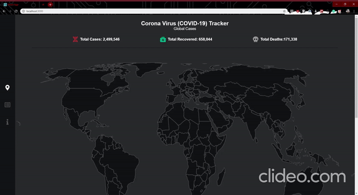

<h4 align="center">
  I created this webapp to track data on Coronavirus (Covid-19)
</h4>
<p align="center">
  

  

  <a href="https://www.codacy.com/app/lukemorales/gobarber-api?utm_source=github.com&amp;utm_medium=referral&amp;utm_content=lukemorales/gobarber-api&amp;utm_campaign=Badge_Grade">
    
  </a>

  <a href="https://github.com/lukemorales/gobarber-api/issues">
    
  </a>

  
</p>

<p align="center">
  <a href="#rocket-technologies">Technologies</a>&nbsp;&nbsp;&nbsp;|&nbsp;&nbsp;&nbsp;
  <a href="#information_source-how-to-use">How To Use</a>&nbsp;&nbsp;&nbsp;|&nbsp;&nbsp;&nbsp;
  <a href="#memo-license">License</a>
</p>

<p align="center">
  
</p>


## :rocket: Technologies

This project was developed with the following technologies:

-  [ReactJS](https://reactjs.org/)
-  [Redux](https://redux.js.org/)
-  [Redux-Saga](https://redux-saga.js.org/)
-  [React Router Dom](https://github.com/ReactTraining/react-router)
-  [styled-components](https://www.styled-components.com/)
-  [Axios](https://github.com/axios/axios)
-  [History](https://www.npmjs.com/package/history)
-  [Immer](https://github.com/immerjs/immer)
-  [React-Toastify](https://fkhadra.github.io/react-toastify/)
-  [React-Icons](http://react-icons.github.io/react-icons/)
-  [date-fns](https://date-fns.org/)
-  [Reactotron](https://infinite.red/reactotron)
-  [React-Loader-Spinner](https://www.npmjs.com/package/react-loader-spinner)
-  [React-Simple-Maps](https://www.react-simple-maps.io/)
-  [React Tooltip](https://www.npmjs.com/package/react-tooltip)
-  [VS Code][vc] with [EditorConfig][vceditconfig] and [ESLint][vceslint]

## :information_source: How To Use

To clone and run this application, you'll need [Git](https://git-scm.com), [Node.js v10.16][nodejs] or higher + [Yarn v1.13][yarn] or higher installed on your computer. From your command line:

```bash
# Clone this repository
$ git clone https://github.com/henriquecampaner/corona-tracker

# Go into the repository
$ cd web

# Install dependencies
$ yarn install

# Run the app
$ yarn start
```

## :memo: License
This project is under the MIT license.

---

Made with ♥ by  <a href="https://www.linkedin.com/in/henrique-campaner/"> Henrique Campaner </a> :wave:


[nodejs]: https://nodejs.org/
[yarn]: https://yarnpkg.com/
[vc]: https://code.visualstudio.com/
[vceditconfig]: https://marketplace.visualstudio.com/items?itemName=EditorConfig.EditorConfig
[vceslint]: https://marketplace.visualstudio.com/items?itemName=dbaeumer.vscode-eslint
